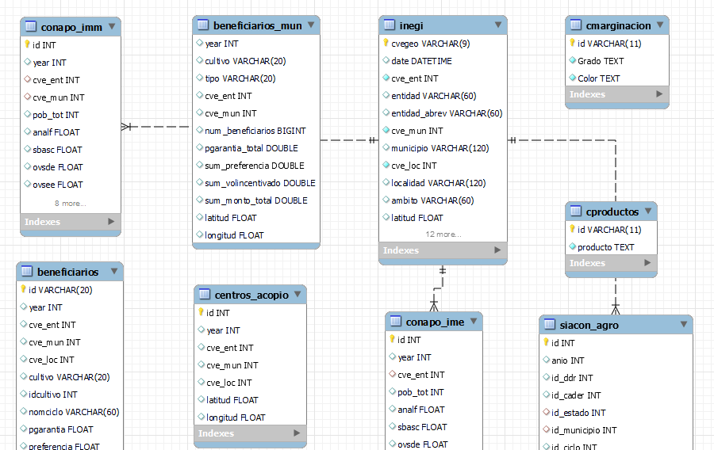

    

# Base de programas sociales

- Base INEGI 

- Base padrón de beneficiarios SEGALMEX a nivel entidad

- Base padrón de beneficiarios SEGALMEX a nivel municipal

- Base padrón de beneficiarios SEGALMEX a nivel localidad

- Base centros de acopio SEGALMEX a nivel municipal

- Base Productores a nivel municipal

- Base producción agricola (SIACON) a nivel entidad

- Base Marginación (CONAPO) a nivel entidad

- Base Marginacipon (CONAPO) a nivel municipal

